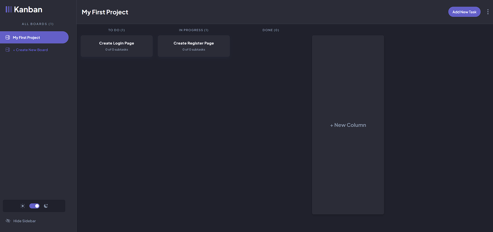

# Kanban Board App

This app built with react.js, express.js and mongoDB. Reduxjs/toolkit used for state management  
TailwindCSS used for styling

## Features

-   Authentication and authorization with JWT
-   Add, Edit, Delete Board
-   Add, Edit, Delete Columns
-   Add, Edit, Delete, View Tasks

## İmages

### Home Page

### Add Board

### Edit Board

### Add Task

### View Task

